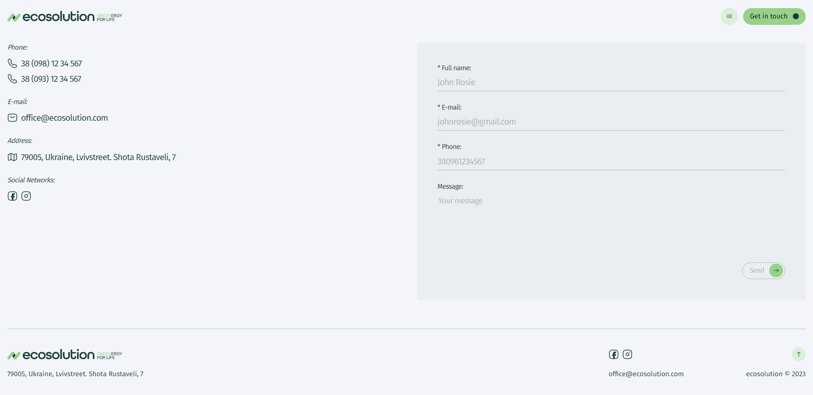

# <h2>EcoSolution</h2>

<p>
    <a href="https://developer.mozilla.org/en-US/docs/Web/JavaScript"></a>
    <a href="https://react.dev/"></a>
    <a href="https://www.npmjs.com/package/yup"></a>
    <a href="https://formik.org/docs/overview"></a>
</p>

---


---

## Опис застосунку

EcoSolution - це веб-додаток, розроблений за допомогою React і Vite. Метою цього
проекту є надання користувачам інтерактивної та зручної платформи для
екологічних рішень у сфері енергетики.

---

## Функціонал

- **_бургер меню_** навігація по сторінці, при натисканні відбувається скрол до
  потрібної секції
- **_слайдер_** перелистування карток виконаних проектів, можливо за допомогою
  кнопок навігації або перетаскуванням за допомогої миші
- **_лічільник_** відображає кількість видобутої електроенергії за допомогою
  єкологічних джереж
- **_список_** відображає список найчастіших питаннь та випадаючих відповідей на
  них при натисканні на текст питання
- **_форма_** форма для зворотнього зв'язку, реалізована валідація і
  відображення помилок при невірному вводі данних.

---


---


---


---


---



---


---

## Розгортання

#### 1. Клонуйте репозиторій проекту

```
    git clone https://github.com/TokarevArtemV/Ecosolution.git
```

#### 2. Встановіть залежності

```
    npm i
```

#### 3. Запустіть сервер

```
    npm run dev
```

---

### **_Приємного настрою та гарного досвіду у використанні!_**

---
